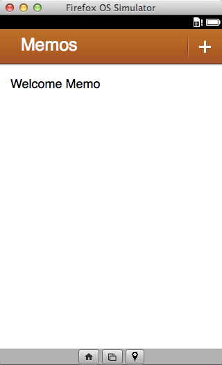

#  Nosso Primeiro App {#firstapp}

Nesse capítulo vamos recontruir o aplicativo **Memos** que é um bloco de notas que eu criei para servir de exemplo em minhas palestras. O código do Memos está disponível no [meu Github](https://github.com/soapdog/memos-for-firefoxos) para quem quiser baixar e olhar logo tudo de uma vez.

O Memos utiliza [IndexedDB](https://developer.mozilla.org/en-US/docs/IndexedDB/Using_IndexedDB) para armazenar as notas e o [Gaia Building Blocks](http://buildingfirefoxos.com/building-blocks) para a construção da sua interface. Em uma atualização futura deste livro eu falarei mais sobre os building blocks, nesta primeira versão eu simplesmente construirei o app.

## Criando o manifesto

O manifesto do Memos é bem simples. Vou colocar ele aqui embaixo e então explicar as partes mais interessantes. Para aprender mais sobre manifestos visite [a página na MDN sobre manifestos](https://developer.mozilla.org/pt-BR/docs/Apps/Manifest).

<<[Manifesto do programa Memos](code/memos/manifest.webapp)

## Estruturando o HTML

## Vestindo nosso app com CSS

## Adicionando o Javascript

## Testando o app no simulador